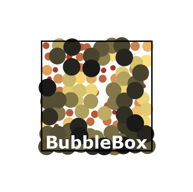

## BubbleBox - 21st century educational toys for jedi-minded scientists

BubbleBox is a pure Python-code for doing 2D molecular dynamics simulations directly in Jupyter Notebooks.

It's main purpose is to allow students to build intuition and understanding of concepts in thermodynamics and chemistry by playing around with systems that exhibits many of the familiar phenomenas we observe in nature such as time evolution, equilibrium, temperature, pressure, phases- and phase changes, entropy, diffusion, mixing and much more. By closely relating theoretical concepts to experimental observations, BubbleBox opens the door for in-depth learning and exploration of our theoretical framework for the physical world in an engaging and interactive way.

BubbleBox is a piece of software developed by Audun Skau Hansen (a.s.hansen@kjemi.uio.no) at the Department of Chemistry, Hylleraas Centre for Quantum Molecular Sciences, University of Oslo.

